# SƠ ĐỒ BPMN - MERMAID
## Hệ thống Đăng ký Khóa học - Trung tâm Ngoại ngữ Hà Ninh

---

## Hướng dẫn sử dụng trong Draw.io

### Cách 1: Chèn Mermaid trực tiếp vào Draw.io
1. Mở draw.io (https://app.diagrams.net)
2. Chọn **Arrange** → **Insert** → **Advanced** → **Mermaid**
3. Copy và paste code Mermaid bên dưới vào
4. Click **Insert**

### Cách 2: Dùng Mermaid Live Editor
1. Truy cập https://mermaid.live
2. Paste code vào panel trái
3. Click **Export** → **PNG/SVG**
4. Import vào draw.io

### Cách 3: VS Code Preview
1. Cài extension "Mermaid Markdown Syntax Highlighting"
2. Mở file này
3. Right-click → **Open Preview**

---

## 1. UC04 - Đăng ký khóa học

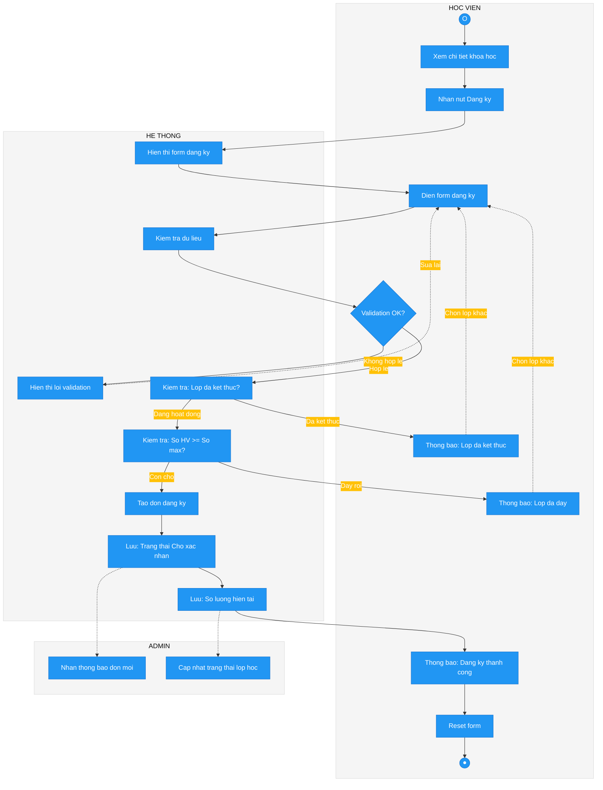

---

## 2. UC11 - Đăng nhập Admin

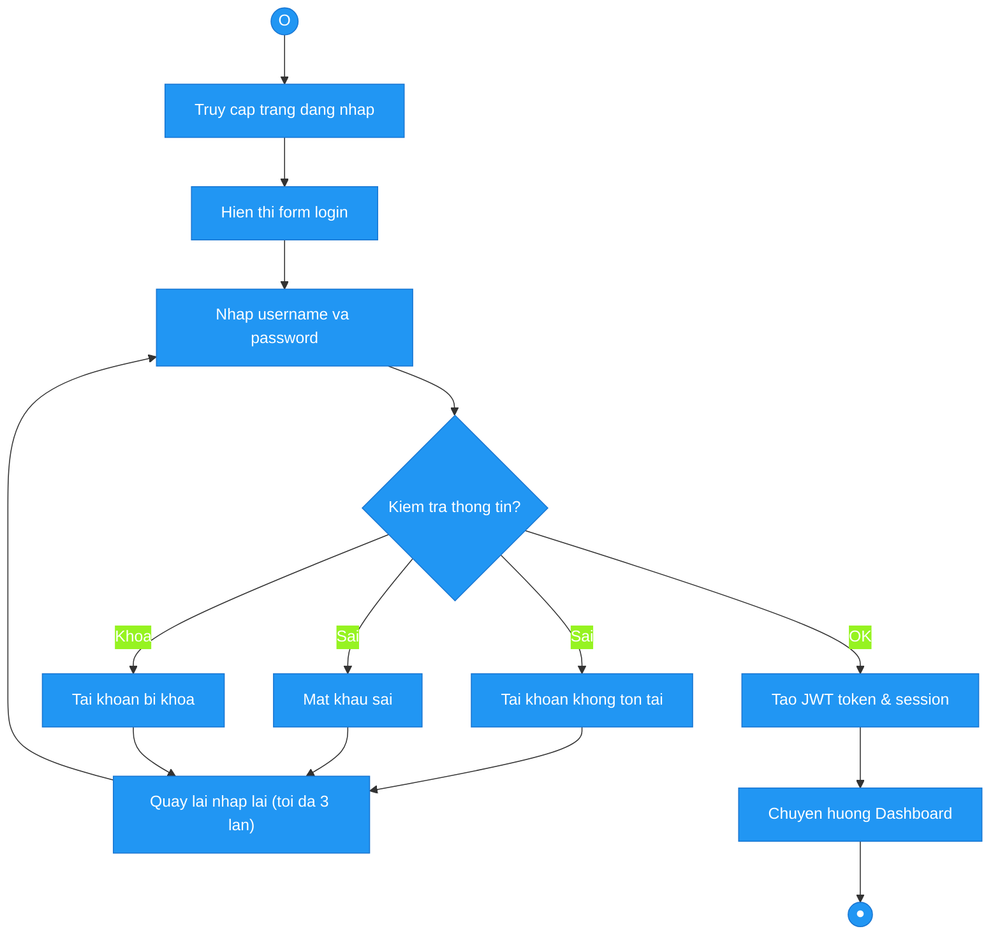

---

## 3. UC15 - Quản lý đơn đăng ký

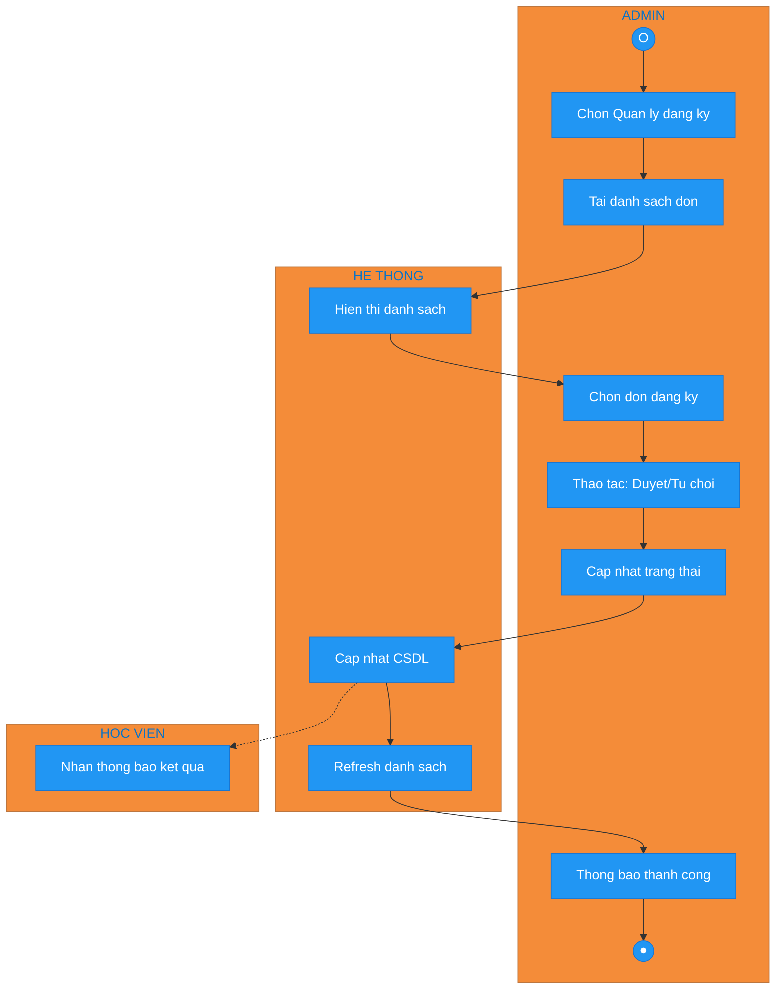

---

## 4. UC05 - Gửi yêu cầu liên hệ

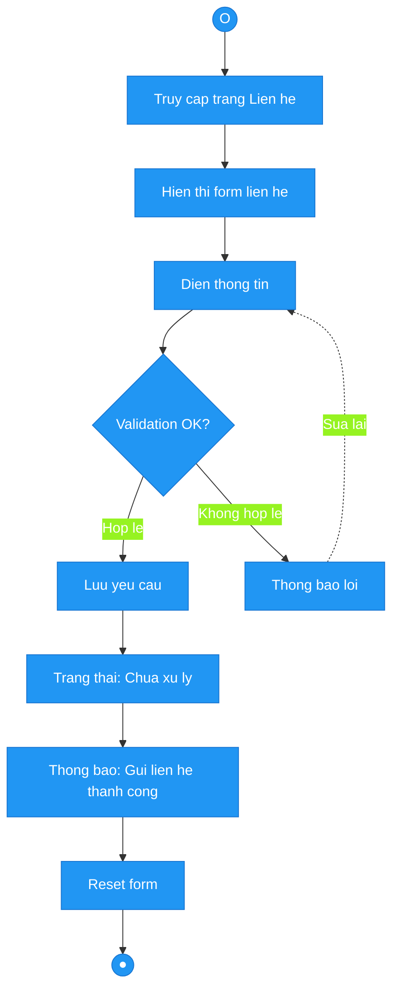

---

## 5. UC17 - Quản lý bài viết diễn đàn

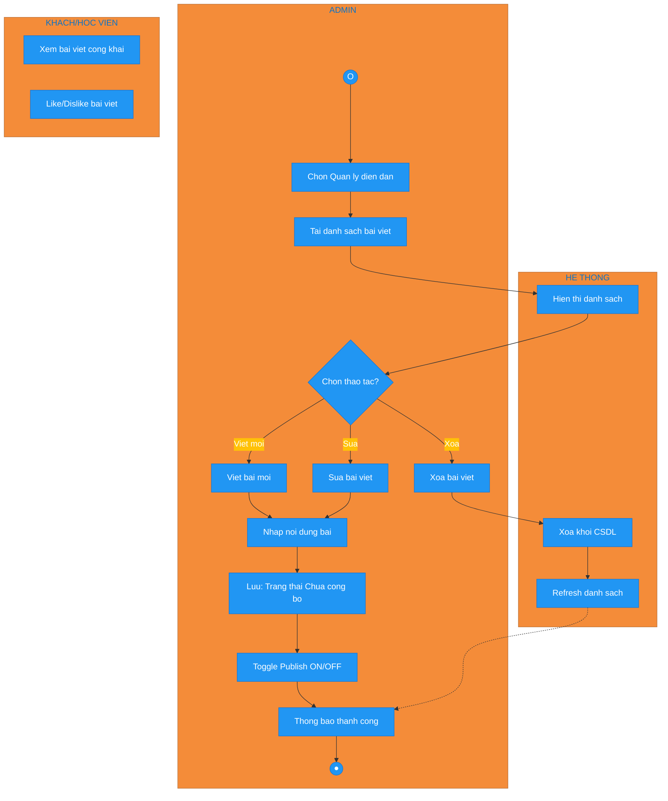

---

## 6. UC06 - Chatbot tư vấn

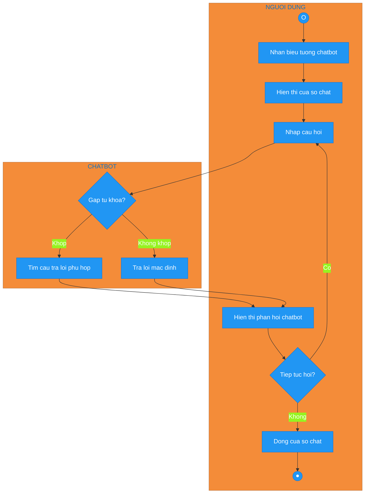

---

## 7. UC13 - Quản lý khóa học (nâng cấp)

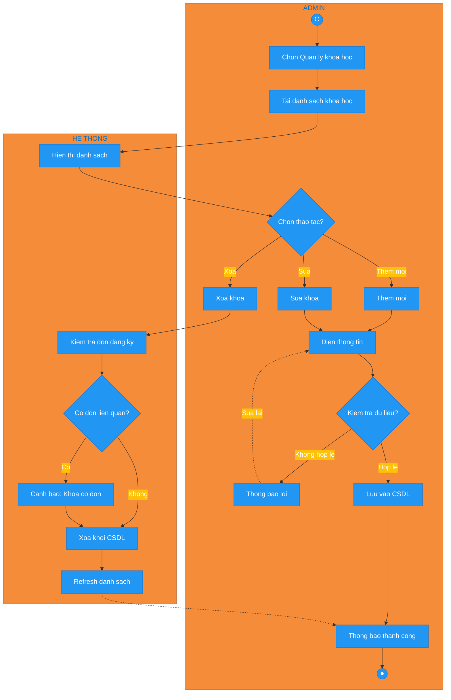

---

## 8. UC14 - Quản lý giảng viên

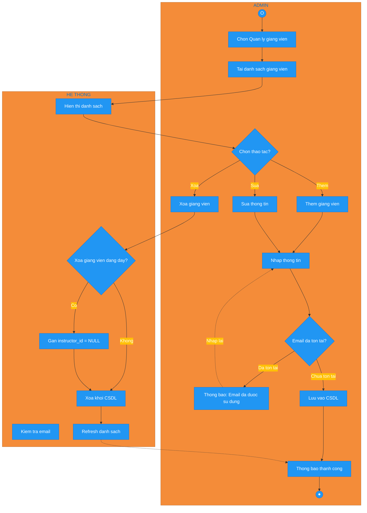

---

## 9. UC16 - Quản lý yêu cầu liên hệ

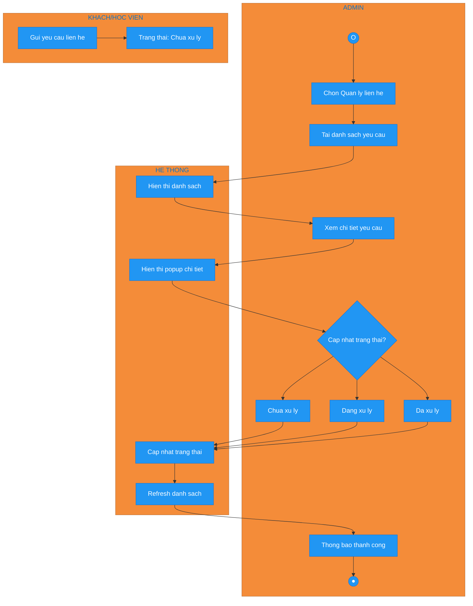

---

## 10. UC18 - Quản lý sĩ số & Trạng thái lớp học (MỚI)

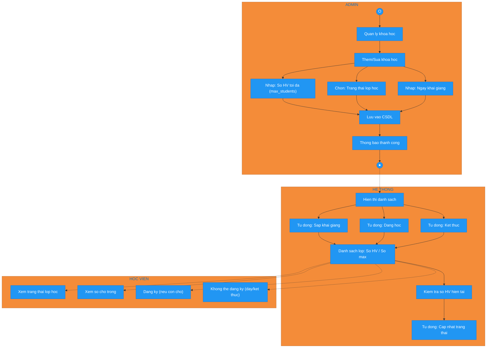

---

## State Diagrams

### Trạng thái lớp học (MỚI)

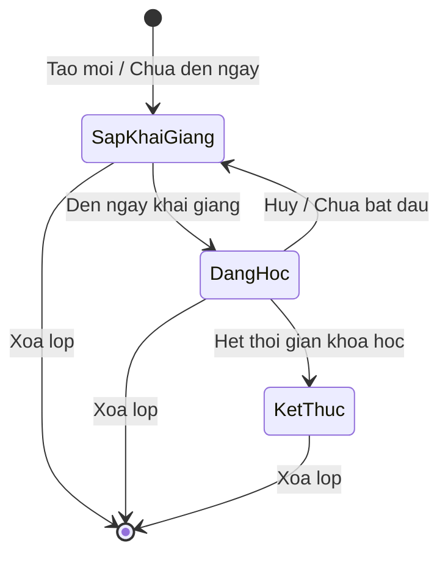

### Trạng thái đơn đăng ký

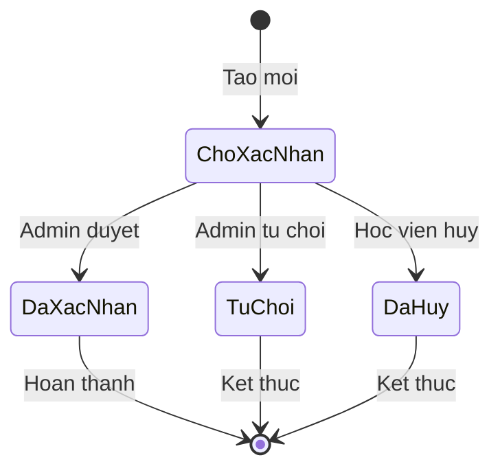

### Trạng thái xử lý liên hệ

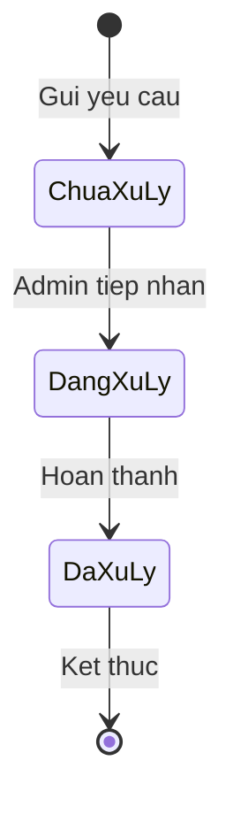

---

## Sequence Diagrams

### UC04 - Đăng ký khóa học (nâng cấp)

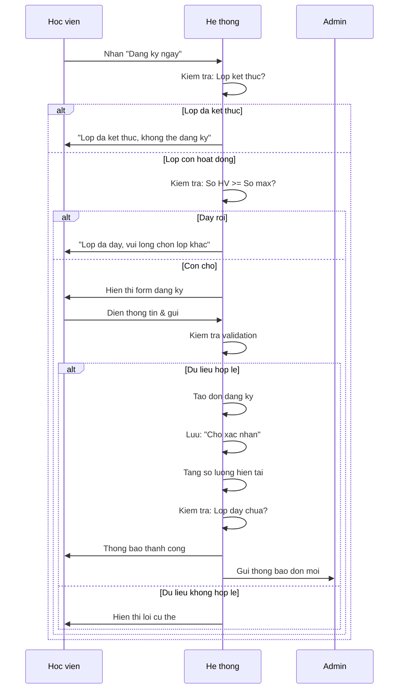

---

## Tổng kết

| STT | Ma | Ten quy trinh |
|-----|-----|---------------|
| 1 | UC04 | Dang ky khoa hoc |
| 2 | UC11 | Dang nhap Admin |
| 3 | UC15 | Quan ly don dang ky |
| 4 | UC05 | Gui yeu cau lien he |
| 5 | UC17 | Quan ly bai viet dien dan |
| 6 | UC06 | Chatbot tu van |
| 7 | UC13 | Quan ly khoa hoc |
| 8 | UC14 | Quan ly giang vien |
| 9 | UC16 | Quan ly yeu cau lien he |
| 10 | UC18 | Quan ly si so & Trang thai lop hoc (MOI) |

---

## Lưu ý

- Copy code từng sơ đồ riêng biệt
- Paste vào draw.io qua **Arrange → Insert → Advanced → Mermaid**
- Hoặc dùng https://mermaid.live để xem trực tiếp
